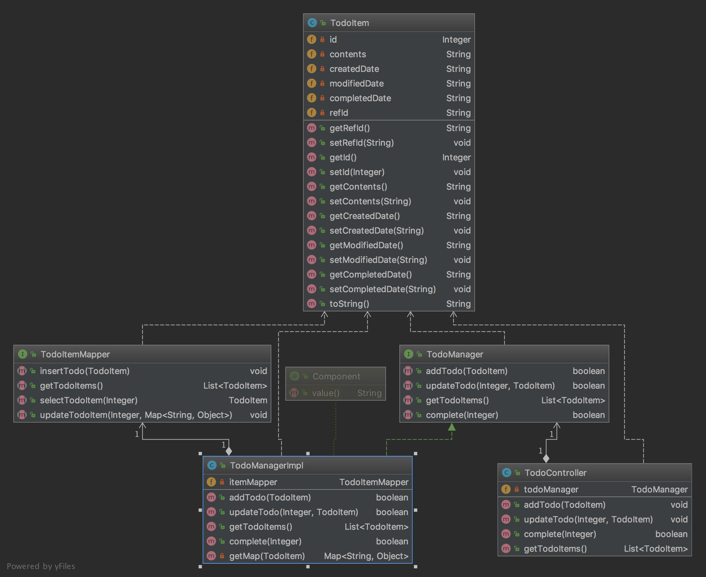

# todo

## Requirements
* _**Functional Requirements**_
    * 사용자는 텍스트로 된 할일을 추가할 수 있다.
        *  할일 추가 시 다른 할일들을 참조 걸 수 있다.
        * 참조는 다른 할일의 id를 명시하는 형태로 구현한다.
    * 사용자는 할일을 수정할 수 있다.
    * 사용자는 할일 목록을 조회할 수 있다.
        * 조회시 작성일, 최종수정일, 내용이 조회 가능하다.
        * 할일 목록은 페이징 기능이 있다.
    * 사용자는 할일을 완료처리 할 수 있다.
        * 완료처리 시 참조가 걸린 완료되지 않은 할일이 있다면 완료처리 할 수 없다.
    
* _**NonFunctional Requirements**_
    * 웹 어플리케이션으로 개발
    * 웹 어플리케이션 개발 언어는 Java, Scala, Golang 중 선택을 권장함
    * 서버는 REST API로 구현
    * 프론트엔드 구현 방법은 제약 없음
    * 데이터베이스는 사용에 제약 없음 (가능하면 In-memory db 사용)
    * 단위테스트 필수, 통합테스트는 선택
    * README.md 파일에 문제해결 전략 및 프로젝트 빌드, 실행 방법 명시

## 문제해결 전략
* 객체
    * 사용자, 할일
        * 사용자는 액터의 역할을 함
        * 사용자 정보를 저장하라는 요구사항이 없으므로 본 과제에서 생략
        
    * 할일 속성
        * 아이디
        * 먼저 할일 아이디
        * 할일 내용
        * 작성일시
        * 수정일시
        * 완료처리
        
    * 할일 객체의 behavior
        1. 할일 추가 
            * parameter: 할일 객체
            * return: 정상 여부
        2. 할일 수정
            * parameter: id, 할일 객체
            * return: 정상 여부
        3. 할일 목록 조회
            * parameter: 페이지 번호 (default=1)
            * return: List<할일객체>
        4. 할일 목록 넘기기(페이지)
            * parameter: 페이지 번호
            * return: List<할일객체>
        5. 할일 완료처리
            * parameter: id
            * return: 정상 여부
            
* Class diagram

* Sequence diagram
    1. 할일 추가
    
    2. 할일 수정
    
    3. 할일 목록 조회
    
    4. 할일 완료처리
    
    
* 비기능 요구사항 및 제약사항
    1. 웹 어플리케션으로 개발
        * 사용자 액터가 한정되어 있고, Traffic이 많지 않을 것으로 예상되어, Spring-boot의 embedded tomcat을 이용하여 개발
    2. 서버는 REST API로 구현
        * Spring-boot의 RestController 이용하여 개발양 단축
        
## Dependencies

|Dependence|Version|
|:--------:|:-----:|
|spring-boot-starter-web|^2.0.4|
|spring-boot-starter-data-jpa|^2.0.4|
|spring-boot-starter-actuator|^2.0.4|
|com.h2database:h2||
|mybatis-spring-boot-starter||

## 실행 방법 및 API Specifications

* Using IDE
    * Run TodoApplication
    * 8004번 포트
    * localhost:8004로 접속

* API Specifications

|Action|API|
|:--------:|:-----:|
|할일 추가|POST: localhost:8004/todos|
|할일 수정|POST: localhost:8004/todos/{id}|
|할일 조회|GET: localhost:8004/todos|
|완료 처리|POST: localhost:8004/todos/{id}/complete|

